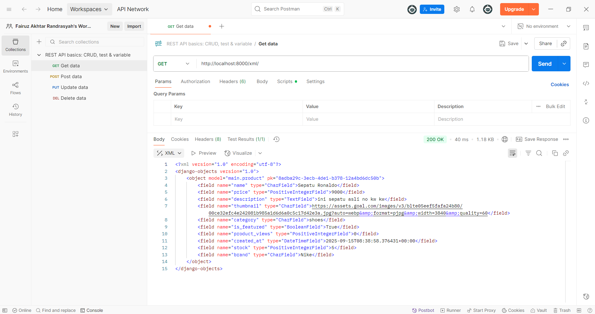
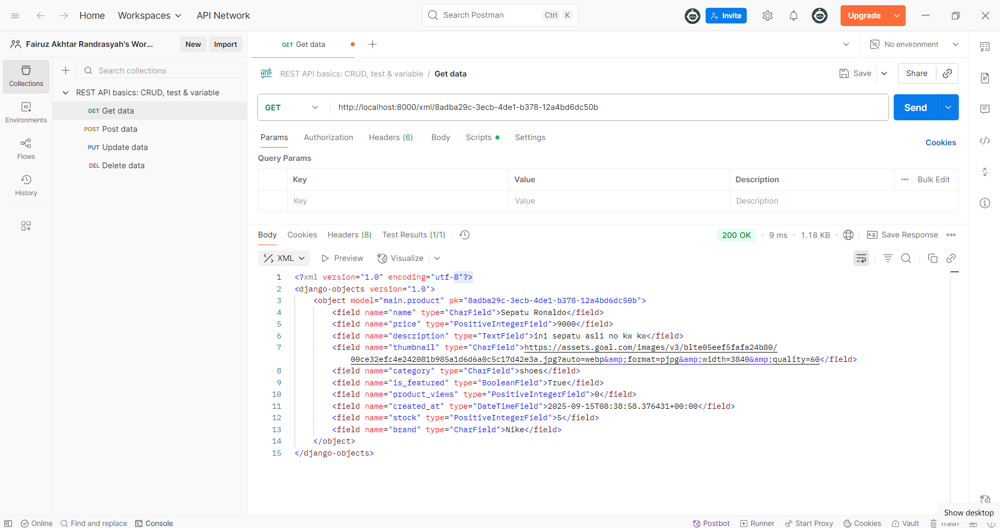
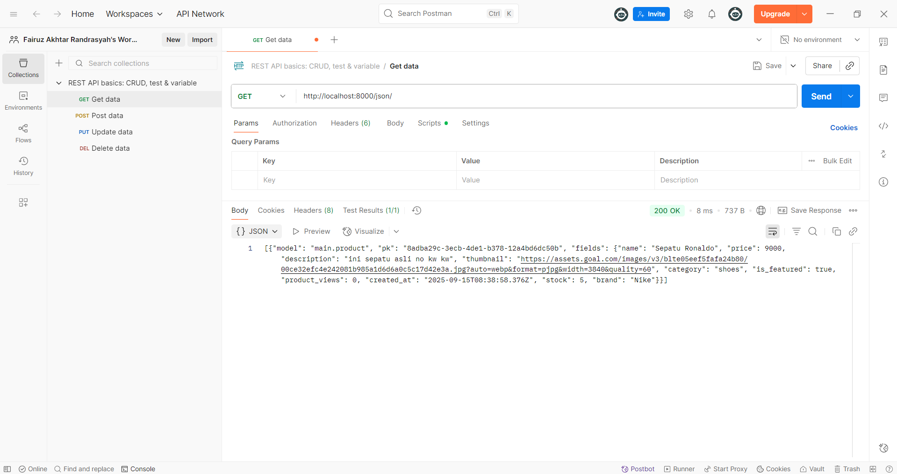

# KickNGoal - Football Shop

**Nama:** Fairuz Akhtar Randrasyah
**NPM:** 2406403955
**Kelas:** PBP D

## Tugas Individu

**Link PWS:** https://fairuz-akhtar-kickngoal.pbp.cs.ui.ac.id/
---

## Tugas 2

1.  - Pertama yaitu saya inisiasi dahulu folder lokal baru bernama KickNGoal (nama football shop saya), saya inisiasi project django baru dengan nama yang sama. Saya inisiasi dulu dengan benar dan mengconnectkannya ke Github dan juga PWS sebelum lanjut membuat app-nya.
    - Setelah konfigurasi settle, environment telah tersambung dengan git dan pws secara benar, baru saya membuat aplikasi dengan nama main menggunakan command 'python manage.py startapp main' lalu saya masukkan ke INSTALLED_APPS.
    - Lalu, saya melakukan routing dengan membuat file urls.py baru di main dan mengatur urls.py di proyek agar dapat mengarahkan ke aplikasi main.
    - Selanjutnya, saya define model dengan menambahkan class Product dengan attribute wajib name, price, description, thumbnail, category, is_featured dan attribute tambahan stock, dan brand. Setelah mendefinisikan model, saya migrasi untuk membuat tabel yang sesuai di database.
    - Setelah itu, saya buat folder baru bernama templates di main dan membuat file baru didalamnya bernama main.html untuk menjadi tampilan dan mengubah views untuk menampilkan info yang sesuai pada halaman yaitu greetings, nama, npm, dan kelas
    - Dan terakhir, saya deploy ke PWS dan tak lupa untuk push ke repositori Github

2.  Client Request → urls.py → views.py → models.py (akses data)
                                  ↓
                              templates/main.html ← context data
                                  ↓
                             HTTP Response → Client

    urls.py: routing URL ke view yang sesuai
    views.py: business logic, memproses request dan mengembalikan response
    models.py: define struktur data dan berinteraksi dengan database
    templates/main.html: template untuk rendering HTML

3.  settings.py merupakan file konfigurasi utama untuk sebuah proyek django, didalamnya terdapat komponen-komponen yang memiliki perannya masing-masing seperti:
    * INSTALLED_APPS: mendaftarkan semua aplikasi yang aktif di dalam proyek.
    * DATABASES: mengkonfigurasi koneksi ke database (misalnya SQLite dan PostgreSQL).
    * SECRET_KEY: kunci rahasia untuk keamanan kriptografi.
    * DEBUG: mode debugging yang menampilkan informasi error terperinci selama pengembangan.
    * STATIC_URL: mengatur lokasi file statis seperti CSS, JavaScript, dan gambar.

4.  Migrasi merupakan cara django untuk mengelola perubahan pada skema database secara terstruktur dan terotomatisasi. Prosesnya ada dua dan harus dilakukan bertahap dan berurutan, yaitu:
    * makemigrations: membandingkan definisi model di models.py dengan file migrasi yang ada. jika ada perubahan (seperti menambah field atau model baru), django akan membuat file migrasi baru yang berisi instruksi untuk menerapkan perubahan tersebut.
    * migrate: menjalankan file-file migrasi yang belum diterapkan. perintah ini akan menerjemahkan instruksi Python dari file migrasi menjadi perintah SQL yang sesuai dan mengeksekusinya di database, sehingga struktur tabel database sinkron dengan model kita.

5.  Menurut saya pertama karena struktur arsitekturnya jelas, MVT dengan separation of concernnya itu mengajarkan kita praktik pengembangan aplikasi yang baik dan terorganisir, proses debugging juga akan jadi lebih mudah. Secara keamanan, django juga relatif aman karena secara otomatis melindungi dari banyak celah misalnya seperti SQL injection. Terakhir, django sudah dikenal luas sehingga sumber belajarnya sangat banyak, dokumentasinya lengkap, jelas, dan tersebar di internet sehingga memudahkan kita untuk mempelajarinya, terutama bagi pemula.

6.  So far, sudah sangat baik. Saya sendiri personally sangat terbantu dengan adanya tutorial yang ada sejauh ini, tidak ada kendala. Mungkin saran saya bisa dibanyaki lagi pre-cautios agar kita lebih was was ketika mau melakukan suatu perintah untuk kita check dan recheck lagi dulu state yang ada sekarang.

---

## Tugas 3

**1. Jelaskan mengapa kita memerlukan data delivery dalam pengimplementasian sebuah platform?**

    Data Delivery sangat penting agar app yang berbeda dapat saling berkomunikasi. Data delivery memungkinkan pertukaran informasi antara klien (ex: browser) dan server. Ketika klien membutuhkan sesuatu, server tidak hanya mengirimkan tampilan, tetapi juga mengirimkan data mentah dalam format terstruktur seperti XML atau JSON.  Contohnya, antara backend dengan aplikasi mobile, atau untuk menyediakan API bagi third party.

**2. Menurutmu, mana yang lebih baik antara XML dan JSON? Mengapa JSON lebih populer dibandingkan XML?**

    Menurut saya pribadi, tampilan dari data XML lebih enak untuk dipandang karena lebih terstruktur dengan kuat. Namun, secara keseluruhan, JSON mungkin lebih baik dan lebih populer karena JSON memiliki sintaks yang ringan dan ringkas sehingga ukuran datanya lebih kecil dan transfer data lebih cepat. Selain itu, strukturnya yang sederhana juga memudahkan kita untuk membaca dan menulis kode yang diinginkan dibandingkan XML yang kaku. Struktur data JSON juga secara langsung memetakan struktur data umum yang ada hampir di semua bahasa pemrograman modern.

**3. Jelaskan fungsi dari method is_valid() pada form Django dan mengapa kita membutuhkan method tersebut?**

    Method is_valid() pada form Django berfungsi sebagai gerbang validasi utama untuk data yang dikirimkan oleh pengguna. Ketika dipanggil, method ini akan memeriksa apakah data yang masuk sudah sesuai dengan semua aturan yang ditetapkan pada form, contohnya seperti tipe data yang benar, field yang wajib diisi, dan aturan lainnya. Jika semua data valid, method ini mengembalikan True dan memindahkan data yang sudah bersih ke dalam atribut form.cleaned_data agar aman untuk digunakan. Jika tidak, ia mengembalikan False dan menyimpan pesan eror untuk ditampilkan kepada pengguna. Kita butuh menggunakan is_valid() mencegah input berbahaya, dan memberikan validasi input yang benar kepada pengguna.

**4. Mengapa kita membutuhkan csrf_token saat membuat form di Django? Apa yang dapat terjadi jika kita tidak menambahkan csrf_token pada form Django? Bagaimana hal tersebut dapat dimanfaatkan oleh penyerang?**

    Kita membutuhkan csrf_token untuk mencegah serangan Cross-Site Request Forgery (CSRF). Serangan CSRF terjadi ketika seorang penyerang memanfaatkan vulnerability dengan menipu pengguna yang sedang login untuk tanpa sadar mengirimkan permintaan berbahaya ke aplikasi web kita (ex: mengubah password atau menghapus data), hal ini lah yang dapat terjadi ketika kita tidak menambahkan csrf_token pada kode kita. Token ini bekerja dengan cara menanamkan sebuah secret value yang unik di dalam form. Saat form dikirim, Django akan memverifikasi apakah token tersebut cocok dengan yang ada di sesi pengguna. Karena situs penyerang tidak dapat mengetahui nilai token ini, setiap permintaan palsu dari mereka akan otomatis ditolak oleh Django.

**5. Jelaskan bagaimana cara kamu mengimplementasikan checklist di atas secara step-by-step (bukan hanya sekadar mengikuti tutorial)**

    - Saya buat direktori baru templates di direktori utama, lalu saya buat file base.html didalamnya untuk menjadi template dasar dari template-template saya lainnya (template lain tinggal extend base.html)
    - Saya tambahkan 'DIRS': [BASE_DIR / 'templates'] di templates pada setting.py agar base.html terbaca
    - Saya extend base.html di main.html saya dan memasukkan kode sebelumnya kedalam block content
    - Saya membuat form dengan membuat file forms.py di main dan mengisi fields-fields yang perlu di input pengguna (fieldsnya berupa atribut dari objek Product di models)
    - Saya membuat fungsi create_product dan show_product pada views lalu menambahkan path url dari fungsi yang telah dibuat
    - Saya update template pada main agar menampilkan data dari product yang ada dan menambahkan button untuk add product
    - Saya membuat 2 file html baru yaitu create_product dan product_detail untuk halaman form input dan read more (pada create product saya tidak lupa untuk menambahkan csrf token untuk menghindari serangan CSRF)
    - Saya menambahkan link deployment saya pada CSRF_TRUSTED_ORIGIN di settings pada direktori project
    - Saya menambahkan fungsi show_xml, show_json, show_xml_by_id, show_json_by_id di views yang mengembalikan HttpResponse untuk menyusun respons yang ingin dikembalikan user kepada user (pada show by id, saya menambahkan try and except untuk memvalidasi jika suatu id tidak ditemukan)
    - Saya import fungsi-fungsi yang saya telah buat sebelumnya ke urls di main lalu menambahkan path URL ke dalam urlpatterns
    - Saya menjalankan server untuk membuka 4 link dan menscreenshot tiap hasil akses URL di POSTMAN

**6. Apakah ada feedback untuk asdos di tutorial 2 yang sudah kalian kerjakan?**

    Aman ajaaaa..

**Screenshot POSTMAN:**

---

## Tugas 4

**1. Apa itu Django AuthenticationForm? Jelaskan kelebihan dan kekurangannya.**

    AuthenticationForm adalah form bawaan django untuk menangani login user. Form ini beda dengan ModelForm karena dia tidak terikat model tertentu tetapi langsung memvalidasi kredensial yang dimasukkan.

    Kelebihan:
    - Sudah teproteksi terhadap serangan CSRF
    - Mudah diimplementasikan hanya dengan impor django.contrib.auth.forms
    - Validasi input salah jelas

    Kekurangan:
    - Customization terbatar dibanding membuat form sendiri dari awal
    - Tampilannya dasar sehingga butuh desain CSS lagi sendiri
    - Hanya untuk login (untuk registrasi dapat menggunakan UserCreationForm)

**2. Apa perbedaan antara autentikasi dan otorisasi? Bagaiamana Django mengimplementasikan kedua konsep tersebut?**

    Autentikasi: proses verifikasi identitas, seperti username dan password. Implementasinya di django menggunakan django.contrib.auth, ada model user yang dilengkapi field bawaan username, password dsb. Fitur bawaan seperti login(), dan authenticate(), dan form seperti AuthenticationForm untuk login dan UserCreationForm untuk regis.

    Otorisasi: proses pemberian hak akses sejauh apa setelah identitas terverifikasi, misal akun user dan admin hak aksesnya berbeda. Implementasinya di django menggunakan Permissions, ada 3 akses dasar yaitu add, change, dan delete. Hak akses lalu dikelompokan kedalam Groups, lalu ada juga penggunaan decorator dan mixin untuk membatasi akses bagi pengguna dengan akses tertentu.

**3. Apa saja kelebihan dan kekurangan session dan cookies dalam konteks menyimpan state di aplikasi web?**

    Cookies (data kecil yang dikirim ke server dan disimpan di browser user)

    Kelebihan:
    - Data disimpan di client-side sehingga tidak membebani server
    - Cookies dapat diatur hingga bertahun-tahun di browser user sehingga sangat berguna untuk fitur yang mengingat pilihan biasa kita
    - Mudah diimplementasikan untuk menyimpan data sederhana

    Kekurangan:
    - Ukurannya sangat terbatas (4kb) sehingga tidak bisa menyimpan data kompleks
    - Karena disimpan di client-side, data cookie rentan akan manipulasi dan pencurian
    - Dapat sedikit menambah overhead pada bandwidth

    Sessions (data pengguna disimpan di sisi server, server membuat id unik dan dikirim dalam bentuk cookie yang disebut session ID)

    Kelebihan:
    - Keamanan lebih baik karena data sensitif disimpan di server
    - Kapasitas jauh lebih besar sehingga dapat menyimpan data yang kompleks
    - Kontrol penuh di server

    Kekurangan:
    - Memakan memori di server
    - Tergantung pada cookie (jika user menonaktifkan cookies, session tidak dapat berfungsi)
    - Kompleksitas dalam distribusi agar dapat konsisten di semua server

**4. Apakah penggunaan cookies aman secara default dalam pengembangan web, atau apakah ada risiko potensial yang harus diwaspadai? Bagaimana Django menangani hal tersebut?**

    Tidak, cookie sangat rentan terhadap resiko keamanan seperti:

    - Hijacking: dilakukan ketika seseorang berhasil mendapat sesi cookie kita sehingga mereka dapat meniru / mengambil alih sesi kita

    - Manipulasi data: data dalam cookie dapat dengan mudah diubah oleh orang. Misalnya untuk mengubah hak akses.

    - Serangan CSRF: penyerang dapat membuat web dummy berbahaya yang ketika dikunjungi akan membuat browser kita otomatis mengirimkan request ke situs lain yang kita sudah login beserta sesi cookie kita, dari situ mereka dapat melakukan tindakan dengan mengatasnamakan kita.

    Cara django menangani: 

    - Django hanya menyimpan session id, bukan data sesi mentah di cookie klien.

    - Cryptographic signing yaitu memberikan tanda tangan kriptografis pada cookies kita agar ketika dimulasi tanda tangan tersebut tidak akan cocok.

    - Proteksi CSRF dengan menanamkan token rahasia yang unik di setiap form POST

**5. Jelaskan bagaimana cara kamu mengimplementasikan checklist di atas secara step-by-step**

    - Saya import UserCreationForm dan messages, lalu membuat fungsi register di views
    - Saya buat direktori baru dengan nama register.html lalu membuat kode untuk menampilkan halaman registrasi
    - Saya import fungsi register ke urls dan memasukkan path url ke urlpatterns
    - Saya import AuthenticationForm, authenticate, dan login, lalu membuat fungsi login di views
    - Saya buat direktori baru dengan nama login.html lalu membuat kode untuk menampilkan halaman login
    - Saya import fungsi login ke urls dan memasukkan path url ke urlpatterns
    - Saya import logout untuk membuat fungsi logout_user dan menambahkan button logout di main.html
    - Saya import logout_user ke urls dan memasukkan path url ke urlpatterns
    - Saya tambahkan login_required pada views dengan decorator @login_required(login_url='/login') di show_main dan show_product untuk merestriksi halaman main dan detail produk
    - Saya import HttpResponseRedirect, reverse, dan datetime untuk menyimpan cookie last_login di fungsi login_user, lalu menambahkan 'last_login': request.COOKIES.get('last_login', 'Never') pada context show_main
    - Saya ubah fungsi logout_user agar mengahapus cookie last_login ketika keluar
    - Saya tambahkan informasi sesi terakhir login di main.html
    - Saya import User pada models dan memasukkan ForeignKey di class Product
    - Saya ubah fungsi create_product agar objek yang dibuat terikat dengan user yang membuatnya
    - Saya ubah fungsi show_main agar menampilkan produk sesuai dengan filter yang dipilih (all product atau my product)
    - Saya tambahkan button pilihan filter di html
    - Saya runserver dan membuat 2 dummy account
    - Saya buat 3 dummy product di lokal untuk tiap accountnya

---

## Tugas 5

**1. Jika terdapat beberapa CSS selector untuk suatu elemen HTML, jelaskan urutan prioritas pengambilan CSS selector tersebut!**

    Urutan didasarkan oleh seberapa spesifik selector tersebut, berikut diurutkan dari prioritas tertinggi:
    1. Inline styles: gaya yang ditulis langsung dalam atribut style 
    2. ID selector: selector yang menargetkan berdasarkan id unik
    3. Class, atribute, psuedo-class selectors:
    4. Element, psuedo-element selectors:
    
**2. Mengapa responsive design menjadi konsep yang penting dalam pengembangan aplikasi web? Berikan contoh aplikasi yang sudah dan belum menerapkan responsive design, serta jelaskan mengapa!**

    Responsive design sangat penting dalam pengembangan web untuk membuat tampilan halaman web dapat berubah secara otomatis sesuai dengan ukuran layar device yang sedang digunakan. Dari sisi user, ini akan meningkatkan pengalaman mereka dalam menggunakan websitenya, sementara dari sisi pengembang, ini akan menghemat waktu dan biaya karena kita hanya perlu mengelola satu basis kode saja.

    Contoh aplikasi:
    Sudah menerapkan: X, pada tampilan web menu lain (seperti notification, explore, etc.) ditaruh disebelah kiri dan di sebelah kanan ditaruh tagar-tagar yang sedang trending. Sementara di mobile, tentu tidak cukup sehingga menu lain ditaruh dibawah dalam bentuk logonya saja tanpa tulisan, serta tagar trending dihilangkan dan hanya muncul di menu explore saja.

    Belum menerapkan: VS Code, tampilan VS Code dedesign untuk tampilan laptop saja dan tidak dapat beradaptasi dengan screen size smartphone.

**3. Jelaskan perbedaan antara margin, border, dan padding, serta cara untuk mengimplementasikan ketiga hal tersebut!**

    Padding: Ruang di dalam elemen, antara konten (teks/gambar) dengan border. Jika kita memberikan background-color pada elemen, warna tersebut akan mengisi area konten dan padding.

    Border: Garis yang mengelilingi padding dan konten. Kita bisa mengatur ketebalan, gaya (misalnya, solid, putus-putus), dan warnanya.

    Margin: Ruang di luar elemen, yaitu jarak antara border elemen tersebut dengan elemen lain di sekitarnya. Margin bersifat transparan dan tidak akan terpengaruh oleh background-color elemen.

    Cara implementasi menggunakan contoh:
    .kotak {
        /* Padding: 20 pixel di semua sisi (atas, kanan, bawah, kiri) */
        padding: 20px;

        /* Border: 2 pixel tebalnya, gayanya solid, warnanya hitam */
        border: 2px solid black;

        /* Margin: 30 pixel di semua sisi */
        margin: 30px;

        background-color: lightblue; /* Warna ini akan mengisi konten dan padding */
        width: 200px;
        height: 100px;
    }

**4. Jelaskan konsep flex box dan grid layout beserta kegunaannya!**

    Flexbox: didesain untuk layout dalam satu dimensi, baik sebagai baris maupun kolom untuk mendistribusikan ruang dan menyelaraskan item-item dalam sebuah container. Kegunaannya adalah untuk menyusun komponen kecil seperti tombol-tombol di dalam sebuah header, item-item navigasi, atau elemen-elemen di dalam card, membuat elemen-elemen bisa mengisi ruang yang tersedia secara fleksibel, dan menyelaraskan item secara vertikal maupun horizontal dengan mudah (misalnya, membuat konten berada tepat di tengah container).

    Grid Layout: didesain untuk layout dalam dua dimensi secara bersamaan, yaitu baris dan kolom. Grid memungkinkan kita untuk membuat struktur tata letak yang kompleks dan presisi, mirip seperti tabel tetapi jauh lebih kuat dan fleksibel. Kegunaannya adalah untuk tata letak halaman utama secara keseluruhan, seperti membagi halaman menjadi area header, sidebar, konten utama, dan footer, membuat galeri gambar yang rapi, dan menyusun elemen-elemen yang harus sejajar baik secara baris maupun kolom

**5. Jelaskan bagaimana cara kamu mengimplementasikan checklist di atas secara step-by-step (bukan hanya sekadar mengikuti tutorial)!**

    - Pertama saya sambungkan template django dengan tailwind dengan menggunakan script CDN
    - Saya tambahkan fitur edit_product dengan menambahkannya di views, lalu membuat tampilan html nya dengan membuat berkas edit_product.html dan mengisi berkas tersebut, lalu saya masukkan fungsi tersebut ke urls
    - Saya perbarui template main.html untuk memunculkan tombol edit pada product
    - Saya tambahkan fitur delete_product dengan menambahkannya di views, lalu membuat tampilan html nya dengan membuat berkas delete_product.html dan mengisi berkas tersebut, lalu saya masukkan fungsi tersebut ke urls
    - Saya perbarui template main.html untuk memunculkan tombol delete pada product
    - Saya membuat navigation bar dengan membuat berkas baru navbar.html di folder templates pada main
    - Saya konfigurasi settings.py untuk bisa memasukkan static files
        saya tambahkan 'whitenoise.middleware.WhiteNoiseMiddleware', di middleware
        dan
        STATIC_URL = '/static/'
        if DEBUG:
            STATICFILES_DIRS = [
                BASE_DIR / 'static' # merujuk ke /static root project pada mode development
            ]
        else:
            STATIC_ROOT = BASE_DIR / 'static'
    - Saya buat direktori baru static/css/global.css sebagai base style css program
    - Saya masukkan global.css ke main.html
    - Saya styling tiap halaman navigation bar, halaman register, halaman home, dan halaman edit product
    - Saya download file no product found untuk disimpan pada file static image untuk ditampilkan ketika produk belum ada
    - Saya buat tampilan untuk card dengan membuat berkas baru dengan nama card_news.html untuk dimasukkan ke halaman main
    - Saya buat tampilan untuk detail produk dengan membuat berkas baru dengan nama product_detail.html